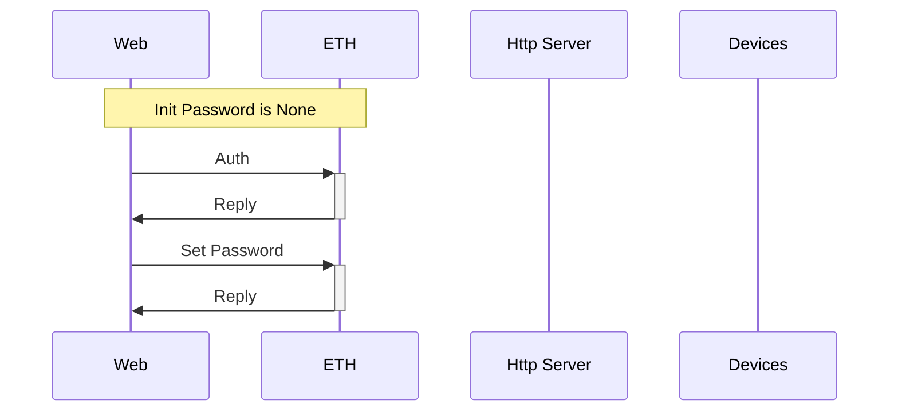
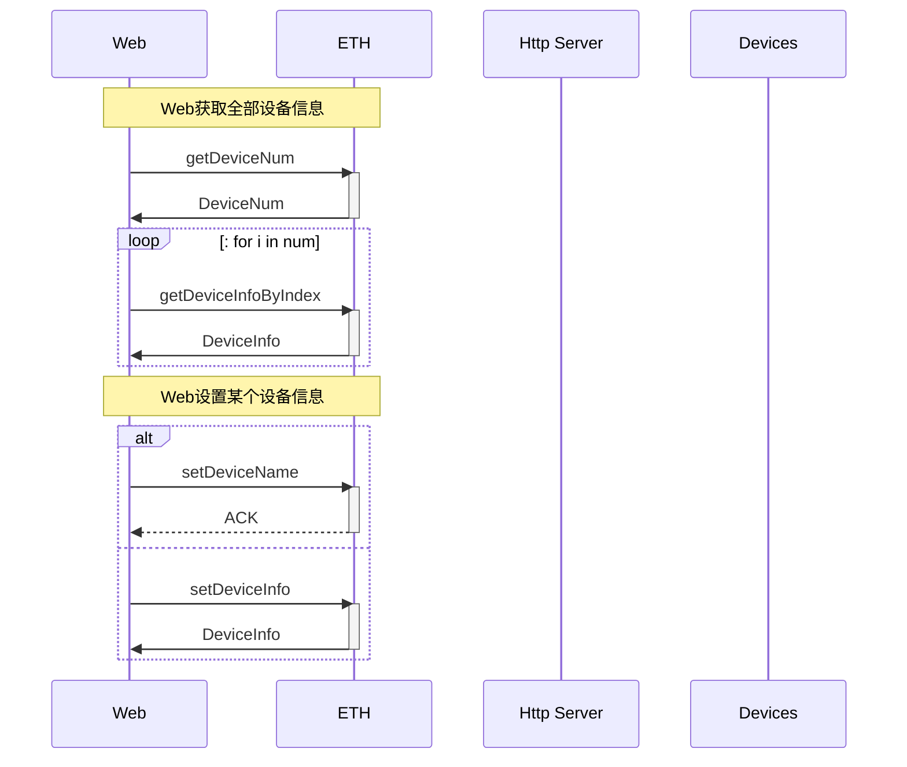
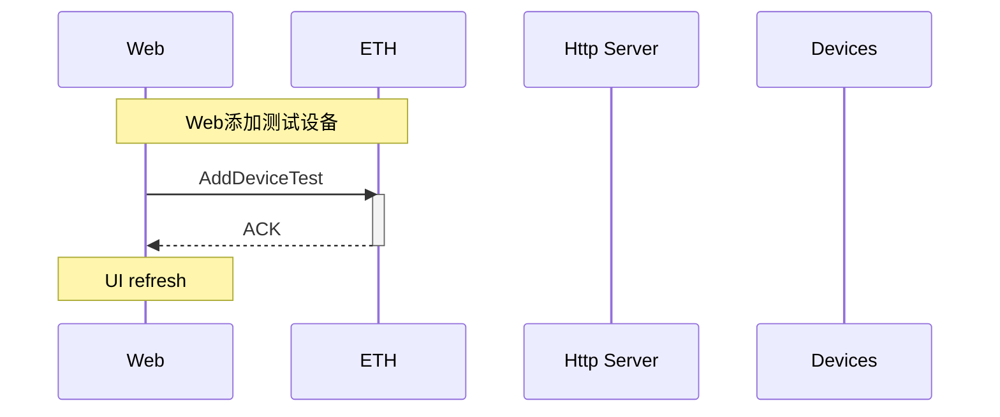
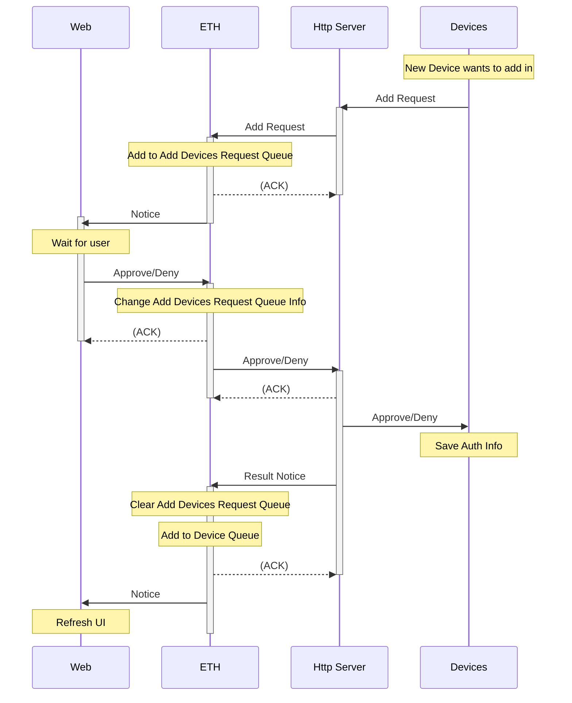

# BoTDap

## 代码结构

|    类别    |       Solidity函数       |       合约API-Web        |  合约API-Node  |   JS-API-Web    |   JS-API-Node   |         简介         |
| :--------: | :----------------------: | :----------------------: | :------------: | :-------------: | :-------------: | :------------------: |
|    Main    |            -             |            -             |       -        |        -        |  web3Operation  |       控制中枢       |
|            |                          |                          |                |                 |                 |                      |
| Auth-Web3  |            -             |       getAccount0        |  getAccount0   |        -        |        -        |   获取accounts[0]    |
| Auth-Web3  |            -             |      unlockAccount0      | unlockAccount0 |        -        |        -        |   解锁accounts[0]    |
| Auth-Web3  |            -             |        addAccount        |   addAccount   |        -        |        -        |       添加账户       |
| Auth-Web3  |            -             |         transfer         |       -        |        -        |        -        |         转账         |
|    Auth    |           auth           |           auth           |       -        |     doLogin     |        -        |   控制面板身份验证   |
|    Auth    |       setPassword        |       setPassword        |       -        |  doSetPassword  |        -        |   控制面板重设密码   |
|            |                          |                          |                |                 |                 |                      |
|   Device   |       getDeviceNum       |       getDeviceNum       |       -        |        -        |        -        |       设备数量       |
|   Device   |      setDeviceName       |      setDeviceName       |       -        |        -        |        -        |     设置设备名称     |
|   Device   |       getDevieInfo       |      getDeviceInfo       |       -        |        -        |        -        |     获取设备信息     |
|   Device   |   getDevieInfoByIndex    |   getDevieInfoByIndex    |       -        |        -        |        -        |     获取设备信息     |
|   Device   |      setDeviceInfo       |      setDeviceInfo       |       -        |  doEditDevice   |        -        |     设置设备信息     |
|   Device   |      addDeviceTest       |      addDeviceTest       |       -        | doAddDeviceTest |                 |     添加测试设备     |
|   Device   |        addDevice         |            -             |   addDevice    |        -        |   doAddDevice   |       添加设备       |
|   Device   |     addDeviceApprove     |     addDeviceApprove     |       -        |        -        |        -        |     添加设备批准     |
|   Device   |     getAddDevListLen     |     getAddDevListLen     |       -        |                 |        -        |   获取设备申请表长   |
|   Device   |    getAddDevListInfo     |    getAddDevListInfo     |       -        |                 |        -        |   获取设备申请信息   |
|   Device   | getAddDevListInfoByIndex | getAddDevListInfoByIndex |       -        |                 |                 |                      |
|   Device   |      addDeviceReply      |            -             | addDeviceReply |        -        | listenAddDevice |   添加设备批准回复   |
|   Device   |       reduceDevice       |       reduceDevice       |                | doDeleteDevice  |                 |       删除设备       |
|   Device   |        authDevice        |        authDevice        |   authDevice   |        -        |                 |       设备认证       |
|   Device   |            -             |            -             |       -        | listenAddDevice |        -        | 监听添加设备相关事件 |
|            |                          |                          |                |                 |                 |                      |
| EventClass |   getEventsClassLength   |   getEventsClassLength   |                |                 |                 | 获取敏感事件类型个数 |
| EventClass |    getEventsClassInfo    |    getEventsClassInfo    |                |                 |                 |   获取敏感事件信息   |
| EventClass |     setEventTypePlan     |     setEventTypePlan     |                |                 |                 | 修改敏感事件应对方案 |
| EventClass |     setEventTypeName     |     setEventTypeName     |                |                 |                 | 修改敏感事件应对名称 |
| EventClass |       addEventType       |       addEventType       |                |                 |                 |     添加事件类型     |
| EventClass |   getEventsClassCount    |   getEventsClassCount    |                |                 |                 | 获取敏感事件类别计数 |
|            |                          |                          |                |                 |                 |                      |
|  ToDoList  |    getToDoListLength     |    getToDoListLength     |                |                 |                 |   获取待办清单长度   |
|  ToDoList  |     getToDoListInfo      |     getToDoListInfo      |                |                 |                 |   获取待办清单信息   |
|  ToDoList  |        toDoListDo        |        toDoListDo        |       -        |                 |                 |      同意/拒绝       |
|            |                          |                          |                |                 |                 |                      |
|   Event    |      getEventLength      |      getEventLength      |                |                 |                 |   获取敏感事件长度   |
|   Event    |         getEvent         |         getEvent         |                |                 |                 |     获取事件信息     |
|   Event    |         setEvent         |         setEvent         |                |                 |                 |  清单信息同意/拒绝   |
|   Event    |        authEvent         |        authEvent         |                |                 |                 |    事件Id合法认证    |

## 认证

| 类别 | Solidity函数 | 合约API-Web | 合约API-Node | JS-API-Web    | JS-API-Node | 简介             |
| ---- | ------------ | ----------- | ------------ | ------------- | ----------- | ---------------- |
| Auth | auth         | auth        | -            | doLogin       | -           | 控制面板身份验证 |
| Auth | setPassword  | setPassword | -            | doSetPassword | -           | 控制面板重设密码 |
|      |              |             |              |               |             |                  |

## 认证相关其他内容

|   类别    | Solidity函数 |  合约API-Web   |  合约API-Node  | JS-API-Web | JS-API-Node |      简介       |
| :-------: | :----------: | :------------: | :------------: | :--------: | :---------: | :-------------: |
| Auth-Web3 |      -       |  getAccount0   |  getAccount0   |     -      |      -      | 获取accounts[0] |
| Auth-Web3 |      -       | unlockAccount0 | unlockAccount0 |     -      |      -      | 解锁accounts[0] |
| Auth-Web3 |      -       |   addAccount   |   addAccount   |     -      |      -      |    添加账户     |
| Auth-Web3 |      -       |    transfer    |       -        |     -      |      -      |      转账       |

## 设备信息查改

|  类别  |       Solidity函数        |        合约API-Web        | 合约API-Node |  JS-API-Web  | JS-API-Node |     简介     |
| :----: | :-----------------------: | :-----------------------: | :----------: | :----------: | :---------: | :----------: |
| Device |       getDeviceNum        |       getDeviceNum        |      -       |      -       |      -      |   设备数量   |
| Device |       setDeviceName       |       setDeviceName       |      -       |      -       |      -      | 设置设备名称 |
| Device |       getDevieInfo        |       getDeviceInfo       |      -       |      -       |      -      | 获取设备信息 |
| Device | getDevieInfo ByIndex | getDevieInfo ByIndex |      -       |      -       |      -      | 获取设备信息 |
| Device |       setDeviceInfo       |       setDeviceInfo       |      -       | doEditDevice |      -      | 设置设备信息 |

## 添加测试设备

|  类别  | Solidity函数  |  合约API-Web  | 合约API-Node |   JS-API-Web    | JS-API-Node |     简介     |
| :----: | :-----------: | :-----------: | :----------: | :-------------: | :---------: | :----------: |
| Device | addDeviceTest | addDeviceTest |      -       | doAddDeviceTest |             | 添加测试设备 |

## Tianjiaxinshebei1

| 类别   | Solidity函数             | 合约API-Web              | 合约API-Node   | JS-API-Web      | JS-API-Node     | 简介                           |
| ------ | ------------------------ | ------------------------ | -------------- | --------------- | --------------- | ------------------------------ |
| Device | addDevice                | -                        | addDevice      | -               | doAddDevice     | 添加设备                       |
| Device | addDeviceApprove         | addDeviceApprove         | -              | -               | -               | 添加设备批准                   |
| Device | getAddDevListLen         | getAddDevListLen         | -              |                 | -               | 获取设备申请表长               |
| Device | getAddDevListInfo        | getAddDevListInfo        | -              |                 | -               | 获取设备申请信息               |
| Device | getAddDevListInfoByIndex | getAddDevListInfoByIndex | -              |                 |                 | 获取设备申请信息(By_Device_In) |
| Device | addDeviceReply           | -                        | addDeviceReply | -               | listenAddDevice | 添加设备批准回复               |
| Device | reduceDevice             | reduceDevice             |                | doDeleteDevice  |                 | 删除设备                       |
| Device | authDevice               | authDevice               | authDevice     | -               |                 | 设备认证                       |
| Device | -                        | -                        | -              | listenAddDevice | -               | 监听添加设备相关事件           |

## 记录种类类别

|    类别    |     Solidity函数     |     合约API-Web      | 合约API-Node | JS-API-Web | JS-API-Node |         简介         |
| :--------: | :------------------: | :------------------: | :----------: | :--------: | :---------: | :------------------: |
| EventClass | getEventsClassLength | getEventsClassLength |              |            |             | 获取敏感事件类型个数 |
| EventClass |  getEventsClassInfo  |  getEventsClassInfo  |              |            |             |   获取敏感事件信息   |
| EventClass |   setEventTypePlan   |   setEventTypePlan   |              |            |             | 修改敏感事件应对方案 |
| EventClass |   setEventTypeName   |   setEventTypeName   |              |            |             | 修改敏感事件应对名称 |
| EventClass |     addEventType     |     addEventType     |              |            |             |   添加敏感事件类型   |
| EventClass | getEventsClassCount  | getEventsClassCount  |              |            |             |   获取敏感事件类别   |