# BoTDap


[TOC]

## 项目介绍

本项目通过区块链技术增强物联网系统安全性。区块链采用本地搭建以太坊私链实现，物联网设备使用esp8266开发版进行模拟，服务器通过node.js构建。

项目具体操作方法为：

1. **物联网系统**进行特定操作前需要得到用户认可。需要**服务器**进行申请，并等待服务器反馈。
2. **服务器**负责的一个功能是向**以太坊**申请设备操作许可，并将结果返回给物联网系统。
3. **服务器**的另一个功能是担任**网站服务器**，在本地局域网开放控制终端，用户登陆后查看物联网系统信息，并通过需要批准的操作。

## 操作流程

1. 创建以太坊`genesis.json`

   ```json
   {
   	"config": {
   		"chainId": 15,
   		"homesteadBlock": 0,
   		"eip150Block": 0,
   		"eip155Block": 0,
   		"eip158Block": 0,
   		"byzantiumBlock": 0,
   		"constantinopleBlock": 0,
   		"petersburgBlock": 0,
   		"ethash": {}
   	},
   	"difficulty": "4500",
   	"gasLimit": "80000000",
   	"alloc": {}
   	}
   }
   ```

2. 创建空白文件`password.txt`

3. 创建私链：`geth --datadir ./mychain/ init ./genesis.json`

   第一个地址是私链文件存放目录，第二个是`genesis.json`目录

4. 开启私链：`geth --datadir ./mychain/ --networkid 15 --dev --dev.period 0 --password password.txt --http --http.api personal,eth,net,web3 --http.corsdomain '*'  --ws --ws.api personal,eth,net,web3 --ws.origins '*' console --allow-insecure-unlock 2>output.log`

## Arduino-API

1. 引入方式

   ```c++
   #include "setting.h"
   #include "BoT.h"
   ```

2. 编辑`setting.h`内容

   ```c++
   // 服务器IP
   const char* BoT_host = "192.168.110.117";
   // 服务器Port
   const int BoT_httpPort = 80; 
   // wifi-AP
   int BoT_AP_number = 2;
   const char* BoT_AP = "{\"name\":[\"name1\",\"name2\"],\"password\":[\"password1\",\"password2\"]}";
   // 设备名称
   String BoT_name = "Lignt";
   // 设备简介
   String BoT_info = "The+first+Internet+of+Things+device";//空格用加号表示!
   ```

3. 在初始化函数中，进行BoT初始化，（可选：并可以进行设备添加以及必要的事件类型添加）

   1. 处理方案1: 直接通过，不记录
   2. 处理方案2: 直接通过，进行记录
   3. 处理方案3: 需要用户手动批准
   4. 处理方案4: 直接拒绝

   ```c++
   void setup(void){
     // 初始化(串口同步, EPROM初始化, 连接Wi-Fi, 设备登录)
     BoT_init();
     // 设备认证
     BoT_doAuth();
     // 事件类型认证 - 事件类型名称 处理方法(1~4)
     BoT_doAuthEventType("Open",2);
   }
   ```

4. 程序运行中进行事件申请（如果申请未通过，会一直执行这一条指令）

   ```c++
   BoT_request("Hello",3);
   ```


## 合约与JS-API

### 认证相关辅助

主要用于Web和Http Server的Web3.js中的操作，辅助合约函数运行。

|   类别    | Solidity函数 |  合约API-Web   |  合约API-Node  | JS-API-Web | JS-API-Node | Introduction_of_function |
| :-------: | :----------: | :------------: | :------------: | :--------: | :---------: | :----------------------: |
| Auth-Web3 |      -       |  getAccount0   |  getAccount0   |     -      |      -      |     获取accounts[0]      |
| Auth-Web3 |      -       | unlockAccount0 | unlockAccount0 |     -      |      -      |     解锁accounts[0]      |
| Auth-Web3 |      -       |   addAccount   |   addAccount   |     -      |      -      |         添加账户         |
| Auth-Web3 |      -       |    transfer    |       -        |     -      |      -      |           转账           |

### 用户界面认证

| 类别 | Solidity函数 | 合约API-Web | 合约API-Node | JS-API-Web    | JS-API-Node | 简介             |
| ---- | ------------ | ----------- | ------------ | ------------- | ----------- | ---------------- |
| Auth | auth         | auth        | -            | doLogin       | -           | 控制面板身份验证 |
| Auth | setPassword  | setPassword | -            | doSetPassword | -           | 控制面板重设密码 |

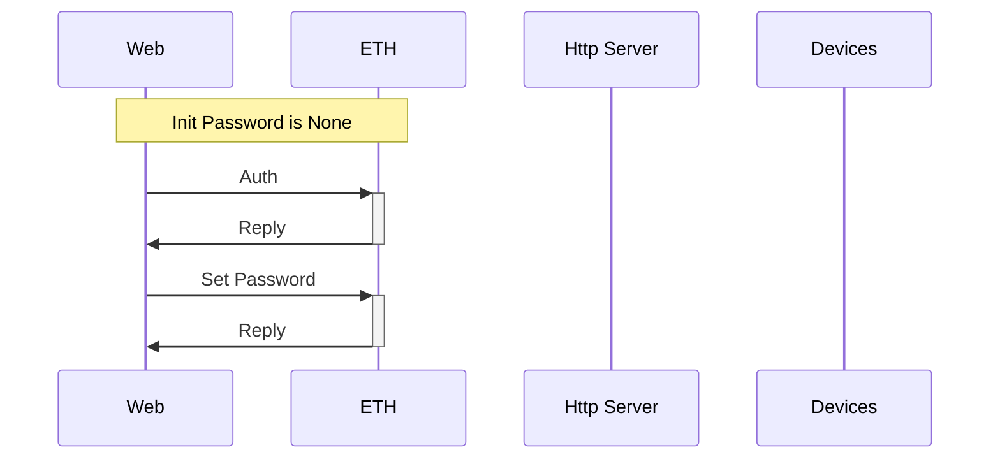

### 设备发起认证

**设备认证函数**目前主要用于合约运行中的验证操作方为注册的设备；

**添加设备认证函数**用于保证已经为进行申请的设备提供了合约账户；

**事件类型认证函数**用于保证发起的事件的类型的合法性；

**事件类型添加认证函数**用于保证设备发起的新事件类型在待确认列表中；

**事件申请认证**用于保证申请的事件在待确认列表中；

|  类别   |       Solidity函数       | 合约API-Web |       合约API-Node       | JS-API-Web | JS-API-Node |     简介     |
| :-----: | :----------------------: | :---------: | :----------------------: | :--------: | :---------: | :----------: |
| Device  |        authDevice        | authDevice  |        authDevice        |     -      |      -      |   设备认证   |
| Device  |      authAddDevice       |      -      |      authAddDevice       |     -      |      -      | 设备添加认证 |
| E-Class |     authEventsClass      |      -      |     authEventsClass      |     -      |      -      | 事件类型认证 |
| E-Class | authAdd<br />EventsClass |      -      | authAdd<br />EventsClass |     -      |      -      |  新类型认证  |
|  Event  |       authAddEvent       |      -      |       authAddEvent       |     -      |      -      | 事件申请认证 |

### 设备信息查改

|  类别  |       Solidity函数        |        合约API-Web        | 合约API-Node |  JS-API-Web  | JS-API-Node |     简介     |
| :----: | :-----------------------: | :-----------------------: | :----------: | :----------: | :---------: | :----------: |
| Device |       getDeviceNum        |       getDeviceNum        |      -       |      -       |      -      |   设备数量   |
| Device |       getDevieInfo        |       getDeviceInfo       |      -       |      -       |      -      | 获取设备信息 |
| Device | getDevie<br />InfoByIndex | getDevie<br />InfoByIndex |      -       |      -       |      -      | 获取设备信息 |
| Device |       setDeviceName       |       setDeviceName       |      -       |      -       |      -      | 设置设备名称 |
| Device |       setDeviceInfo       |       setDeviceInfo       |      -       | doEditDevice |      -      | 设置设备信息 |

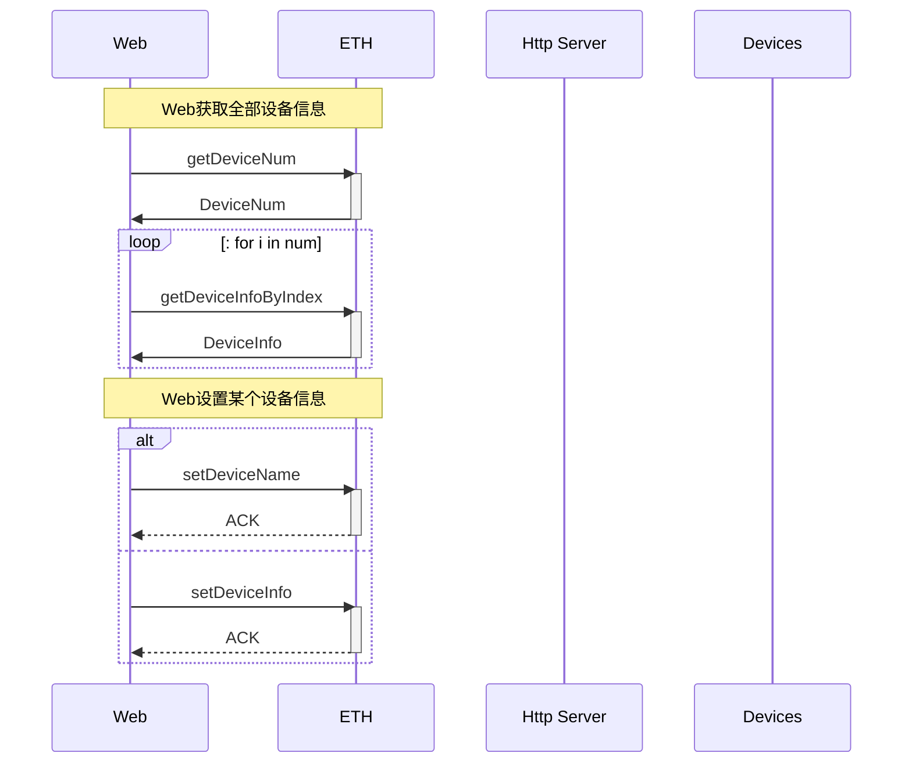

### 添加测试设备

|  类别  | Solidity函数  |  合约API-Web  | 合约API-Node |   JS-API-Web    | JS-API-Node | Introduction_of_function |
| :----: | :-----------: | :-----------: | :----------: | :-------------: | :---------: | :----------------------: |
| Device | addDeviceTest | addDeviceTest |      -       | doAddDeviceTest |      -      |       添加测试设备       |

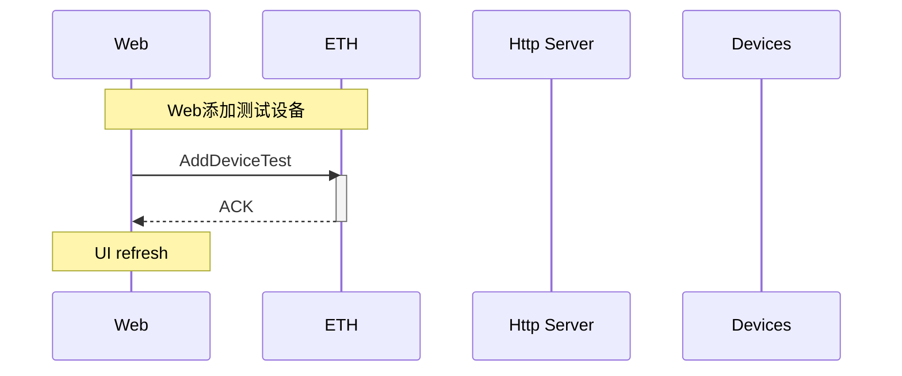

### 删除设备

删除设备操作会删除这个设备的一切历史信息，包括：设备信息，设备敏感事件申请记录，代办清单中该设备申请记录，事件列表中该设备的申请次数。

|  类别  | Solidity函数 | 合约API-Web  | 合约API-Node |   JS-API-Web   | JS-API-Node |   简介   |
| :----: | :----------: | :----------: | :----------: | :------------: | :---------: | :------: |
| Device | reduceDevice | reduceDevice |              | doDeleteDevice |             | 删除设备 |

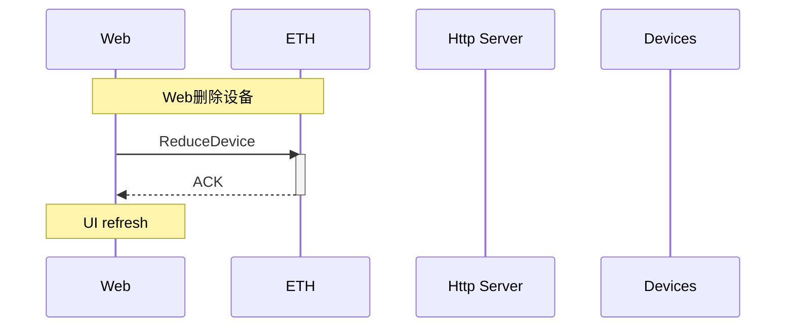

### 添加设备

| 类别   | Solidity函数             | 合约API-Web              | 合约API-Node   | JS-API-Web      | JS-API-Node     | Introduction_of_function       |
| ------ | ------------------------ | ------------------------ | -------------- | --------------- | --------------- | ------------------------------ |
| Device | getAddDevListLen         | getAddDevListLen         | -              |                 | -               | 获取设备申请表长               |
| Device | getAddDevListInfo        | getAddDevListInfo        | -              |                 | -               | 获取设备申请信息               |
| Device | getAddDevListInfoByIndex | getAddDevListInfoByIndex | -              |                 |                 | 获取设备申请信息(By_Device_In) |
| Device | addDeviceTest            | addDeviceTest            | -              | doAddDeviceTest |                 | 添加测试设备                   |
| Device | addDevice                | -                        | addDevice      | -               | doAddDevice     | 添加设备                       |
| Device | addDeviceApprove         | addDeviceApprove         | -              | -               | -               | 添加设备批准                   |
| Device | addDeviceReply           | -                        | addDeviceReply | -               | listenAddDevice | 添加设备批准回复               |
| Device | addDeviceState           | -                        | addDeviceState | -               | -               | 添加设备状态跟踪               |
| Device | -                        | -                        | -              | listenAddDevice | -               | 监听添加设备相关事件           |

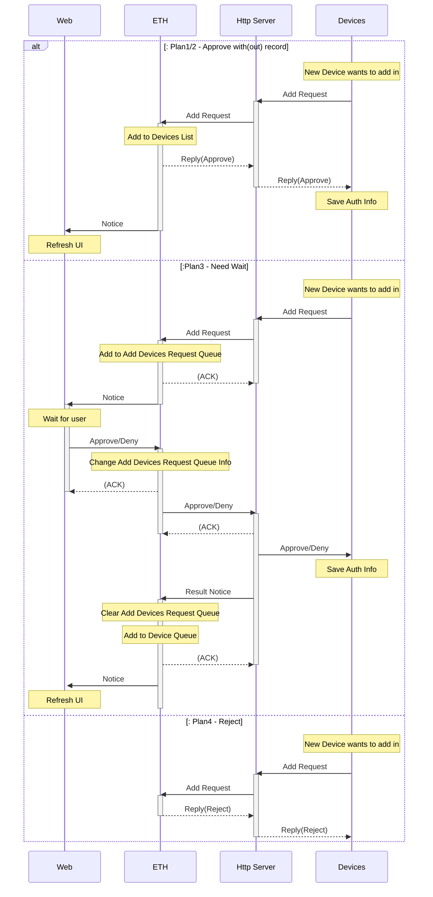

### 记录种类类别

|    类别    |       Solidity函数       |     合约API-Web      |       合约API-Node       |     JS-API-Web      | JS-API-Node | Introduction_of_function |
| :--------: | :----------------------: | :------------------: | :----------------------: | :-----------------: | :---------: | :----------------------: |
| EventClass |   getEventsClassLength   | getEventsClassLength |            -             |          -          |      -      |   获取敏感事件类型个数   |
| EventClass |    getEventsClassInfo    |  getEventsClassInfo  |    getEventsClassInfo    |          -          |      -      |     获取敏感事件信息     |
| EventClass | getEventsClassInfoByName |          -           | getEventsClassInfoByName |          -          |      -      |     获取敏感事件信息     |
| EventClass |   getEventsClassIndex    |          -           |   getEventsClassIndex    |          -          |      -      |     获取敏感事件序号     |
| EventClass |   getEventsClassCount    | getEventsClassCount  |            -             |          -          |      -      |     获取敏感事件类别     |
| EventClass |     setEventTypePlan     |   setEventTypePlan   |            -             | doSetEventClassPlan |      -      |   修改敏感事件应对方案   |
| EventClass |     setEventTypeName     |   setEventTypeName   |            -             | doSetEventClassName |      -      |   修改敏感事件应对名称   |

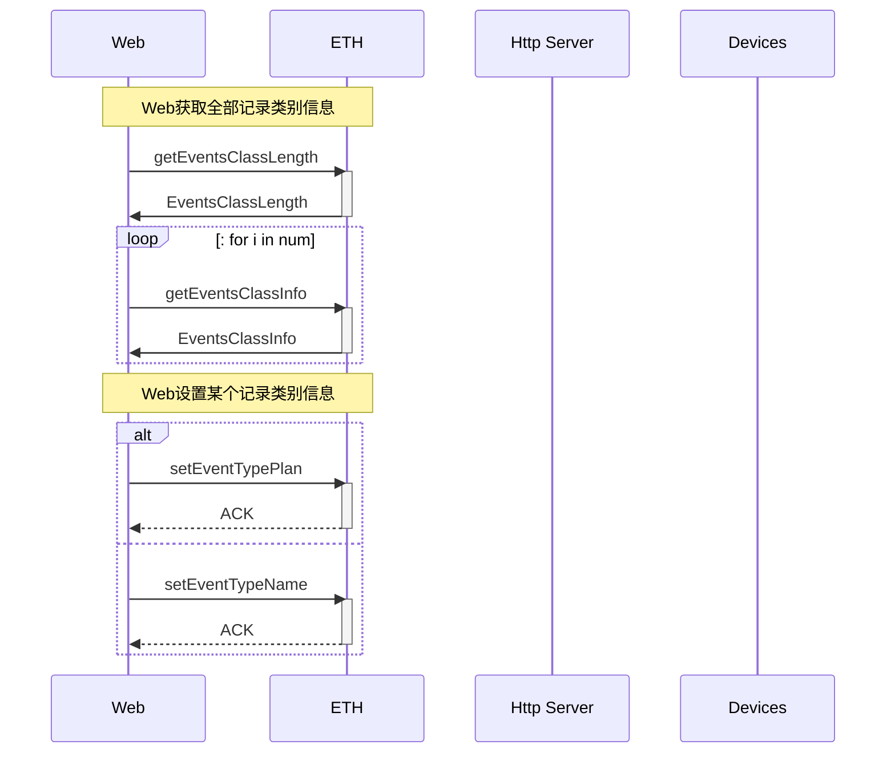

### 添加事件类型

|    类别    |     Solidity函数      |      合约API-Web      |    合约API-Node     | JS-API-Web | JS-API-Node | Introduction_of_function |
| :--------: | :-------------------: | :-------------------: | :-----------------: | :--------: | :---------: | :----------------------: |
| EventClass |  getEventsClassIndex  |  getEventsClassIndex  |          -          |     -      |      -      |   获取敏感事件类型序号   |
| EventClass | getAddEventsClassLen  | getAddEventsClassLen  |          -          |     -      |      -      |   获取敏感事件申请表长   |
| EventClass | getAddEventsClassInfo | getAddEventsClassInfo |          -          |     -      |      -      |   获取敏感事件申请信息   |
| EventClass |  addEventsClassTest   |  addEventsClassTest   |          -          |     -      |      -      |     添加测试事件类型     |
| EventClass |    addEventsClass     |           -           |   addEventsClass    |     -      |      -      |     添加事件类型申请     |
| EventClass | addEventsClassApprove | addEventsClassApprove |          -          |     -      |      -      |     添加事件类型审批     |
| EventClass |    addEventsState     |           -           |   addEventsState    |     -      |      -      |     添加事件类型进度     |
| EventClass |  addEventsClassReply  |           -           | addEventsClassReply |     -      |      -      |     添加事件类型回复     |

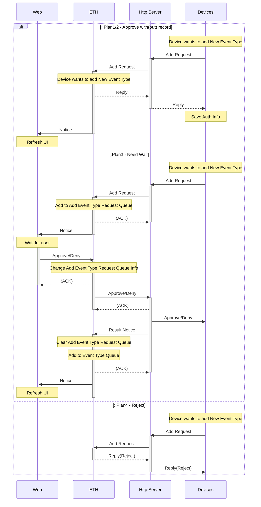

### 添加测试事件类型

|    类别    |    Solidity函数    |    合约API-Web     | 合约API-Node |     JS-API-Web      | JS-API-Node | Introduction_of_function |
| :--------: | :----------------: | :----------------: | :----------: | :-----------------: | :---------: | :----------------------: |
| EventClass | addEventsClassTest | addEventsClassTest |      -       | doAddEventClassTest |      -      |     添加敏感事件类型     |

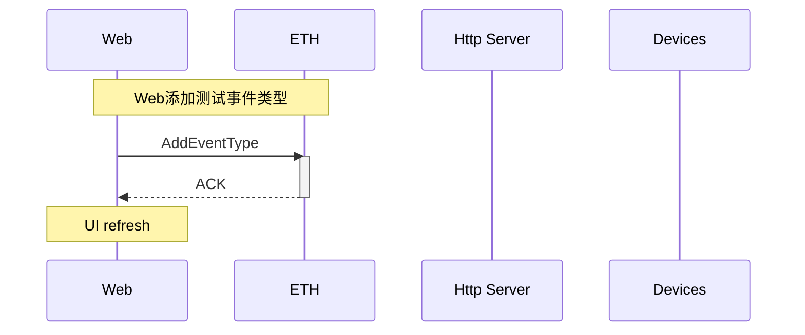

### 敏感事件

| 类别  |  Solidity函数  |  合约API-Web   | 合约API-Node | JS-API-Web | JS-API-Node | Introduction_of_function |
| :---: | :------------: | :------------: | :----------: | :--------: | :---------: | :----------------------: |
| Event | getEventLength | getEventLength |      -       |     -      |      -      |     获取事件长度函数     |
| Event |    getEvent    |    getEvent    |      -       |     -      |      -      |    获取事件的测试函数    |

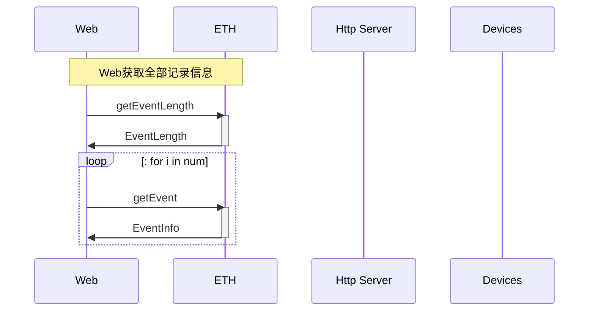

### 代办清单

|   类别   |   Solidity函数    |    合约API-Web    | 合约API-Node  | JS-API-Web | JS-API-Node | Introduction_of_function |
| :------: | :---------------: | :---------------: | :-----------: | :--------: | :---------: | :----------------------: |
| ToDoList | getToDoListLength | getToDoListLength |       -       |     -      |      -      |     获取待办清单长度     |
| ToDoList |  getToDoListInfo  |  getToDoListInfo  |       -       |     -      |      -      |     获取待办清单信息     |
| ToDoList |   addEventTest    |   addEventTest    |       -       |     -      |      -      |     敏感测试事件申请     |
| ToDoList |     addEvent      |         -         |   addEvent    |     -      |      -      |       敏感事件申请       |
| ToDoList |  addEventApprove  |  addEventApprove  |       -       |     -      |      -      |        同意/拒绝         |
| ToDoList |   addEventState   |         -         | addEventState |     -      |      -      |         状态查询         |
| ToDoList |   addEventReply   |         -         | addEventReply |     -      |      -      |           回复           |

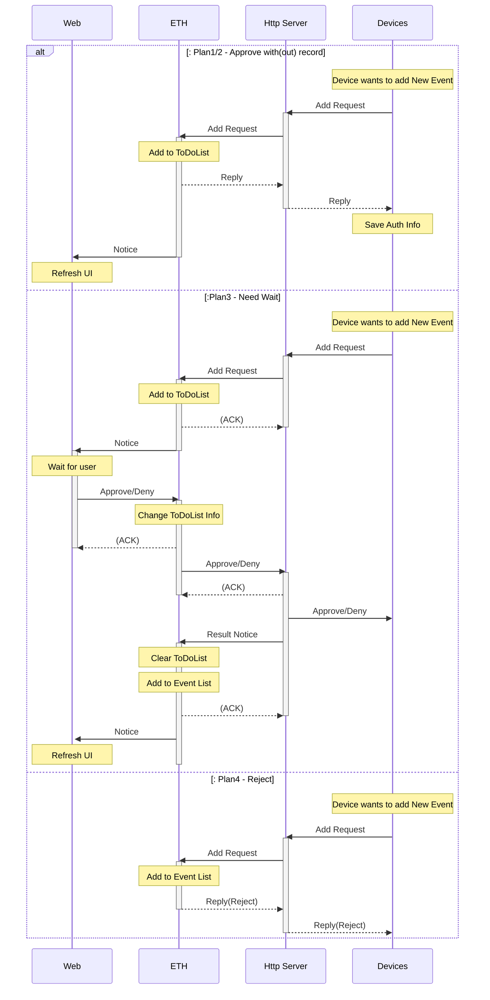


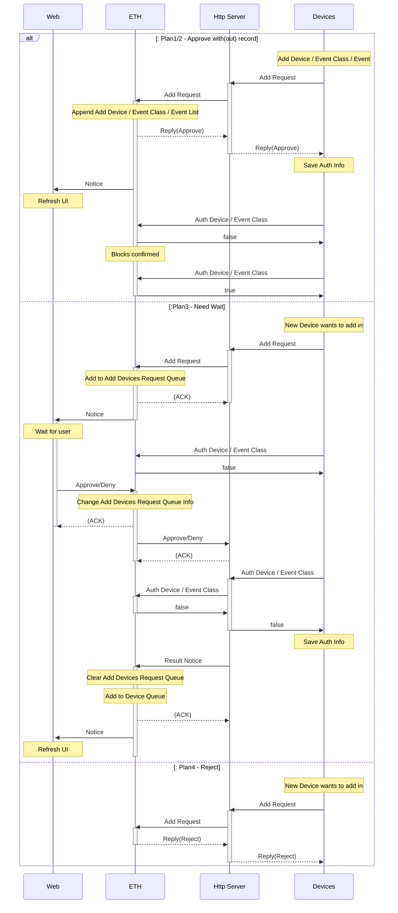

