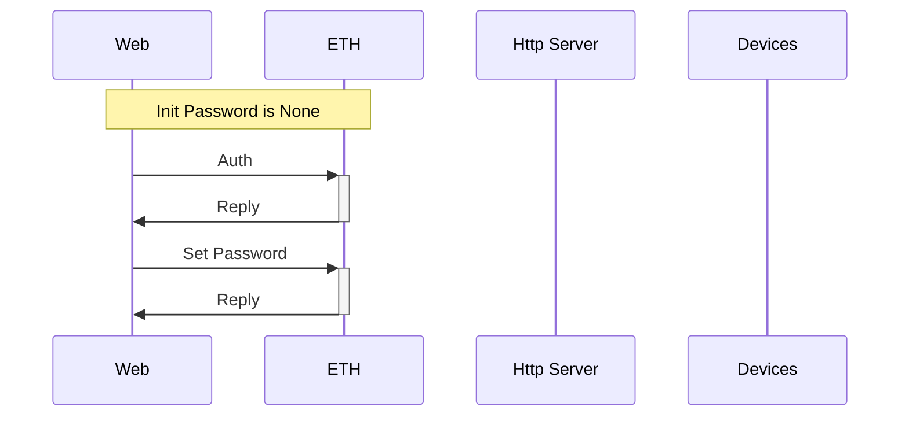
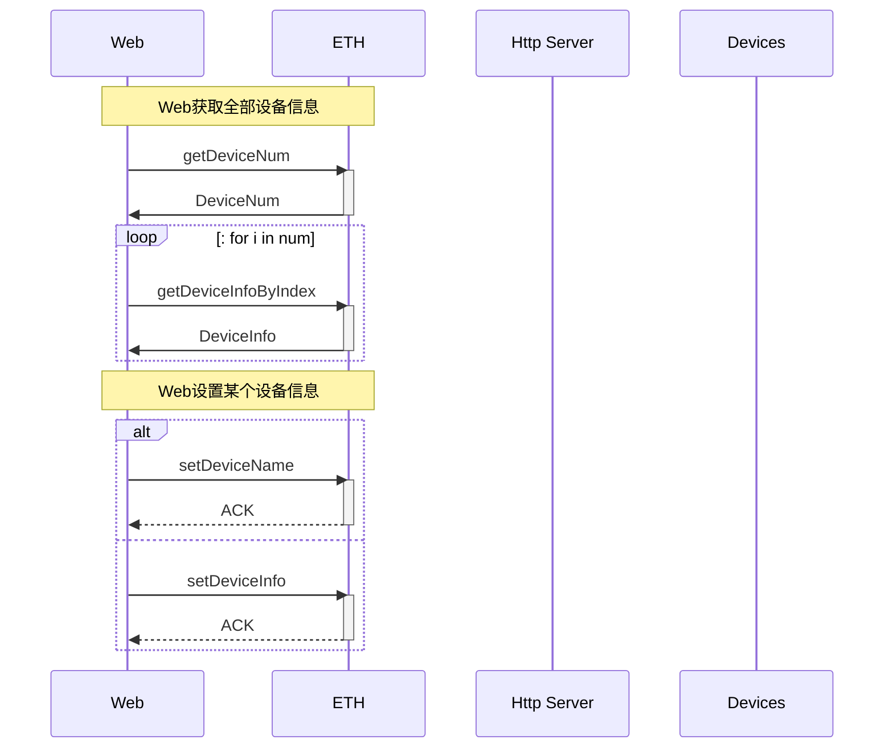
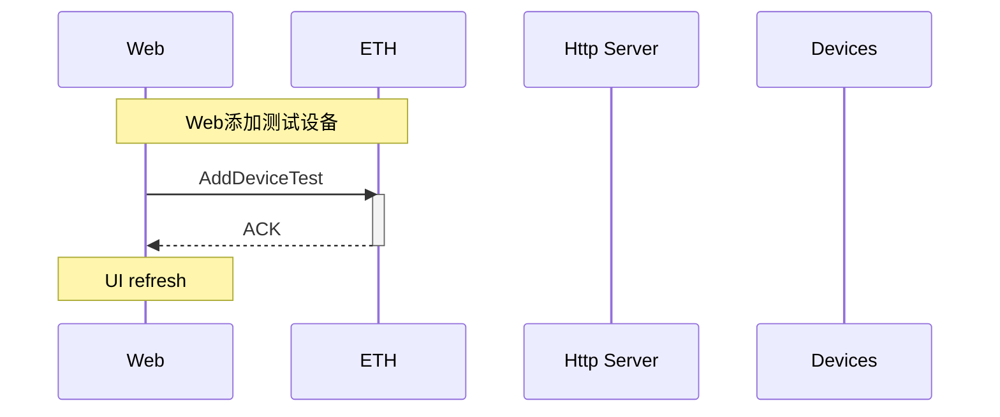
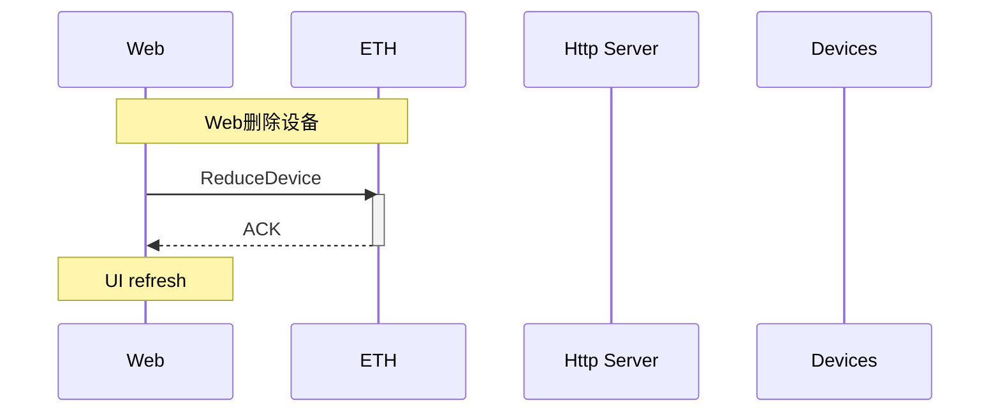
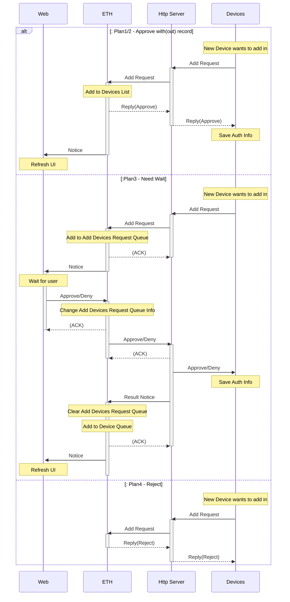
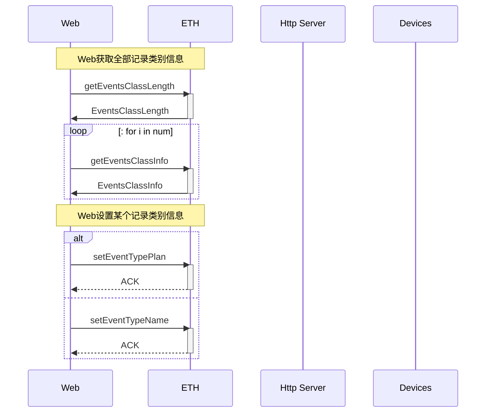
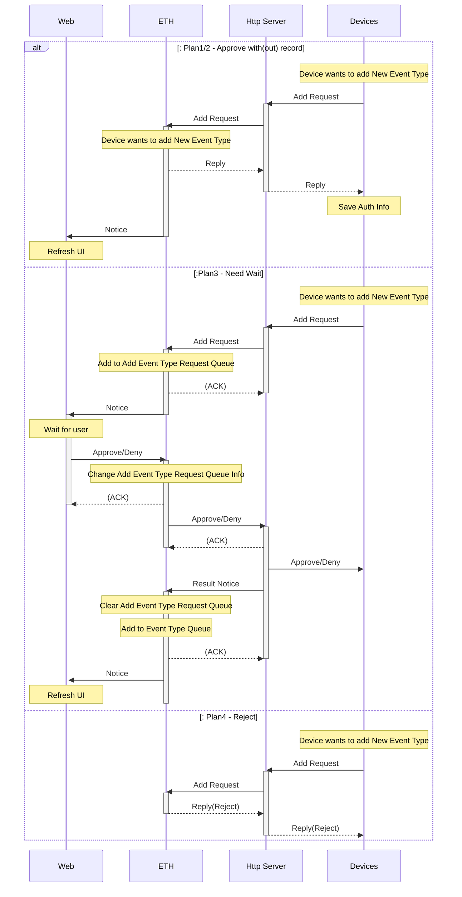
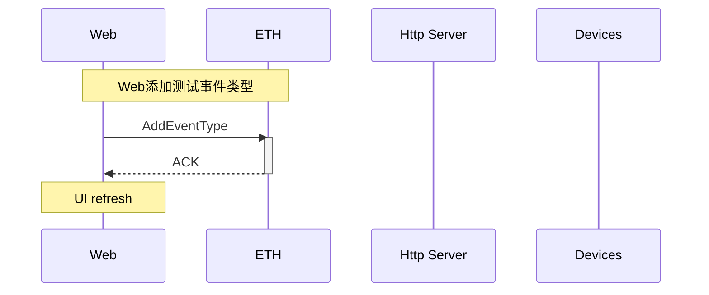
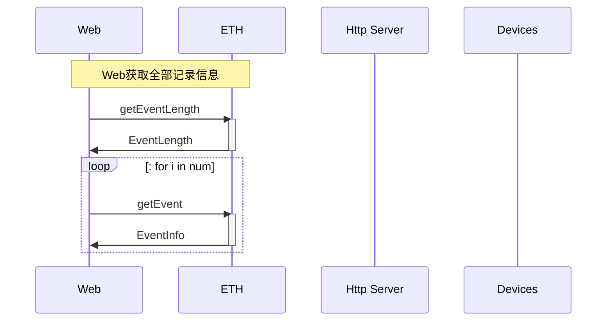
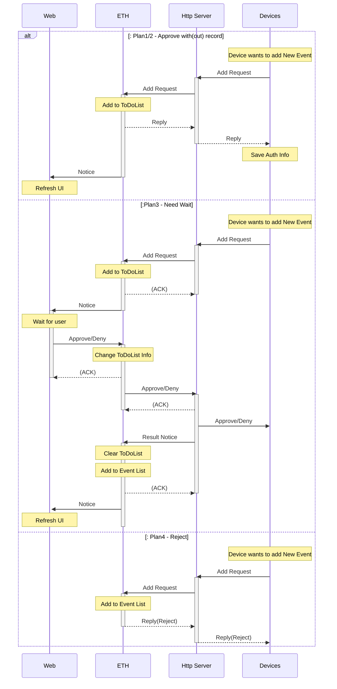

# BoTDap

[TOC]

## 认证

| 类别 | Solidity函数 | 合约API-Web | 合约API-Node | JS-API-Web    | JS-API-Node | 简介             |
| ---- | ------------ | ----------- | ------------ | ------------- | ----------- | ---------------- |
| Auth | auth         | auth        | -            | doLogin       | -           | 控制面板身份验证 |
| Auth | setPassword  | setPassword | -            | doSetPassword | -           | 控制面板重设密码 |

## 认证相关其他内容

主要用于Web和Http Server的Web3.js中的操作，辅助合约函数运行。

|   类别    | Solidity函数 |  合约API-Web   |  合约API-Node  | JS-API-Web | JS-API-Node |      简介       |
| :-------: | :----------: | :------------: | :------------: | :--------: | :---------: | :-------------: |
| Auth-Web3 |      -       |  getAccount0   |  getAccount0   |     -      |      -      | 获取accounts[0] |
| Auth-Web3 |      -       | unlockAccount0 | unlockAccount0 |     -      |      -      | 解锁accounts[0] |
| Auth-Web3 |      -       |   addAccount   |   addAccount   |     -      |      -      |    添加账户     |
| Auth-Web3 |      -       |    transfer    |       -        |     -      |      -      |      转账       |

## 设备信息查改

|  类别  |       Solidity函数        |        合约API-Web        | 合约API-Node |  JS-API-Web  | JS-API-Node |     简介     |
| :----: | :-----------------------: | :-----------------------: | :----------: | :----------: | :---------: | :----------: |
| Device |       getDeviceNum        |       getDeviceNum        |      -       |      -       |      -      |   设备数量   |
| Device |       getDevieInfo        |       getDeviceInfo       |      -       |      -       |      -      | 获取设备信息 |
| Device | getDevieInfo ByIndex | getDevieInfo ByIndex |      -       |      -       |      -      | 获取设备信息 |
| Device |       setDeviceName       |       setDeviceName       |      -       |      -       |      -      | 设置设备名称 |
| Device |       setDeviceInfo       |       setDeviceInfo       |      -       | doEditDevice |      -      | 设置设备信息 |

## 添加测试设备

|  类别  | Solidity函数  |  合约API-Web  | 合约API-Node |   JS-API-Web    | JS-API-Node |     简介     |
| :----: | :-----------: | :-----------: | :----------: | :-------------: | :---------: | :----------: |
| Device | addDeviceTest | addDeviceTest |      -       | doAddDeviceTest |      -      | 添加测试设备 |

## 删除设备

删除设备操作会删除这个设备的一切历史信息，包括：设备信息，设备敏感事件申请记录，代办清单中该设备申请记录，事件列表中该设备的申请次数。

|  类别  | Solidity函数 | 合约API-Web  | 合约API-Node |   JS-API-Web   | JS-API-Node |   简介   |
| :----: | :----------: | :----------: | :----------: | :------------: | :---------: | :------: |
| Device | reduceDevice | reduceDevice |              | doDeleteDevice |             | 删除设备 |

## 设备认证

设备认证函数目前主要用于合约运行中的验证操作方为注册的设备

|  类别  | Solidity函数 | 合约API-Web | 合约API-Node | JS-API-Web | JS-API-Node |   简介   |
| :----: | :----------: | :---------: | :----------: | :--------: | :---------: | :------: |
| Device |  authDevice  | authDevice  |  authDevice  |     -      |             | 设备认证 |

## 添加设备

| 类别   | Solidity函数             | 合约API-Web              | 合约API-Node   | JS-API-Web      | JS-API-Node     | 简介                           |
| ------ | ------------------------ | ------------------------ | -------------- | --------------- | --------------- | ------------------------------ |
| Device | getAddDevListLen         | getAddDevListLen         | -              |                 | -               | 获取设备申请表长               |
| Device | getAddDevListInfo        | getAddDevListInfo        | -              |                 | -               | 获取设备申请信息               |
| Device | getAddDevListInfoByIndex | getAddDevListInfoByIndex | -              |                 |                 | 获取设备申请信息(By_Device_In) |
| Device | addDeviceTest            | addDeviceTest            | -              | doAddDeviceTest |                 | 添加测试设备                   |
| Device | addDevice                | -                        | addDevice      | -               | doAddDevice     | 添加设备                       |
| Device | addDeviceApprove         | addDeviceApprove         | -              | -               | -               | 添加设备批准                   |
| Device | addDeviceReply           | -                        | addDeviceReply | -               | listenAddDevice | 添加设备批准回复               |
| Device | -                        | -                        | -              | listenAddDevice | -               | 监听添加设备相关事件           |

## 记录种类类别

|    类别    |     Solidity函数     |     合约API-Web      | 合约API-Node | JS-API-Web | JS-API-Node |         简介         |
| :--------: | :------------------: | :------------------: | :----------: | :--------: | :---------: | :------------------: |
| EventClass | getEventsClassLength | getEventsClassLength |              |            |             | 获取敏感事件类型个数 |
| EventClass |  getEventsClassInfo  |  getEventsClassInfo  |              |            |             |   获取敏感事件信息   |
| EventClass | getEventsClassCount  | getEventsClassCount  |              |            |             |   获取敏感事件类别   |
| EventClass |   setEventTypePlan   |   setEventTypePlan   |              |            |             | 修改敏感事件应对方案 |
| EventClass |   setEventTypeName   |   setEventTypeName   |              |            |             | 修改敏感事件应对名称 |

## 添加事件类型

|    类别    |     Solidity函数      |      合约API-Web      | 合约API-Node | JS-API-Web | JS-API-Node |         简介         |
| :--------: | :-------------------: | :-------------------: | :----------: | :--------: | :---------: | :------------------: |
| EventClass | getAddEventsClassLen  | getAddEventsClassLen  |              |            |             | 获取敏感事件申请表长 |
| EventClass | getAddEventsClassInfo | getAddEventsClassInfo |              |            |             | 获取敏感事件申请信息 |
| EventClass |  addEventsClassTest   |  addEventsClassTest   |              |            |             |   添加测试事件类型   |
| EventClass |    addEventsClass     |    addEventsClass     |              |            |             |   添加事件类型申请   |
| EventClass | addEventsClassApprove | addEventsClassApprove |              |            |             |   添加事件类型审批   |
| EventClass |  addEventsClassReply  |  addEventsClassReply  |              |            |             |   添加事件类型回复   |

## 添加测试事件类型

|    类别    | Solidity函数 | 合约API-Web  | 合约API-Node | JS-API-Web | JS-API-Node |       简介       |
| :--------: | :----------: | :----------: | :----------: | :--------: | :---------: | :--------------: |
| EventClass | addEventType | addEventType |              |            |             | 添加敏感事件类型 |

## 敏感事件

| 类别  |  Solidity函数  |  合约API-Web   | 合约API-Node | JS-API-Web | JS-API-Node |        简介        |
| :---: | :------------: | :------------: | :----------: | :--------: | :---------: | :----------------: |
| Event | getEventLength | getEventLength |              |            |             |  获取事件长度函数  |
| Event |    getEvent    |    getEvent    |              |            |             | 获取事件的测试函数 |

## 代办清单

|   类别   |   Solidity函数    |    合约API-Web    | 合约API-Node | JS-API-Web | JS-API-Node |       简介       |
| :------: | :---------------: | :---------------: | :----------: | :--------: | :---------: | :--------------: |
| ToDoList | getToDoListLength | getToDoListLength |              |            |             | 获取待办清单长度 |
| ToDoList |  getToDoListInfo  |  getToDoListInfo  |              |            |             | 获取待办清单信息 |
| ToDoList |     addEvent      |     addEvent      |              |            |             |   敏感事件申请   |
| ToDoList |    toDoListDo     |    toDoListDo     |              |            |             |    同意/拒绝     |

